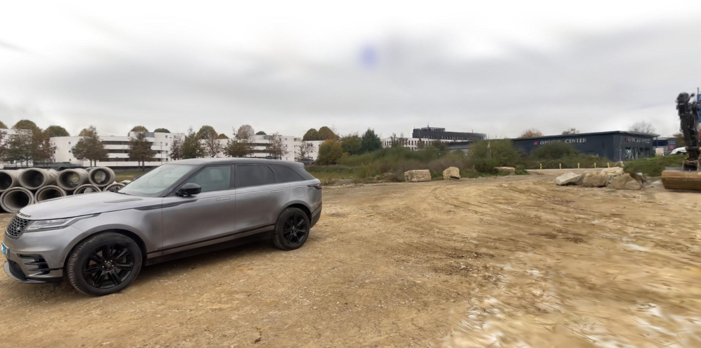
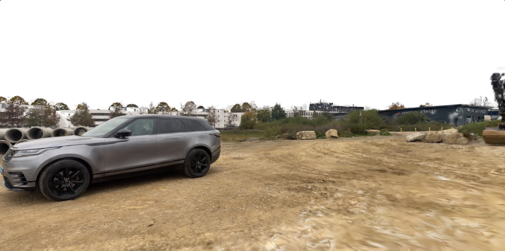

<h1 align="center">gCull</h1>

A command-line tool to clean noisy Gaussian primitives associated with sky and clouds in 3D Gaussian Splatting (3DGS) reconstructions.

<p align="center">
  
  
</p>

## 💾 Installation

### 1. Create & activate the Conda environment
```bash
conda create -n gcull python=3.11 -c conda-forge
conda activate gcull
```
### 2. Install dependencies

```bash
# Change directories to project root (gCull/):
cd <project-dir: gCull>

# Install CUDA-enabled PyTorch, SAM2, & CLIP:
pip install -r requirements.txt

# Install the gCull package and its CLI entrypoints:
pip install -e .
```
### 3. Install CUDA Backend
```bash
cd gCullCUDA
pip install . 
```

### 4. Download SAM2 for semantic Masks
```bash
mkdir -p models
wget https://dl.fbaipublicfiles.com/segment_anything_2/092824/sam2.1_hiera_large.pt -P models
```

## 🎭 About Masks

This tool uses binary masks to identify and remove unwanted Gaussian primitives (e.g., sky or clouds) from 3DGS reconstructions.

- Masks are automatically generated using gcull process-masks.

- Each mask is a binary image where:

  - Black pixels (value 0) mark regions to remove.

  - White pixels (value 255) mark regions to keep.

- Masks are saved to ```data/<experiment-name>/masks/``` and matched by filename to the corresponding images (e.g., frame_0001.png ↔ mask_0001.png).

If you already have semantic masks or wish to use custom ones, you can place them directly in the masks/ folder following the same naming convention.

## 📂 File Structure (Input Layout)

The tool requires the following structure:

```text
gCull/
├── data/
│   └── <experiment-name>/
│       ├── colmap/
│       ├── images/            ← put your source JPG/PNG files here
│       └── transforms.json
|
├── outputs/
│   └── <experiment-name>/
│       └── splatfacto/
│           └── <model-name>/
│               └── config.yml ← 3DGS YAML for `cull-model`
├── models/                    ← where SAM2 weights will be downloaded
```

## 🚀 Execution

From your project root, you now have two top-level commands:

```bash
# 1) Generate binary masks
gcull process-masks \
  --data_dir <path/to/images> [--prompt <prompt>] [--inspect]

# 2) Cull Gaussians using those masks
gcull cull-model \
  --load-config <path/to/config.yml>
```

### Command details
```process-masks```\
Creates a binary mask for each image in --data_dir based on your prompt.

- ```--data_dir <path/to/images>```\
Directory containing input JPG/PNG images.

- ```--prompt <"prompt">```\
Class to detect (default: "sky").

- ```--inspect``` (*optional boolean flag*)\
If ```true```, displays the first mask and every 10th mask in a pop-up window before saving.
Default: ```false```.

<br>

```cull-model```\
Loads 3DGS YAML configuration and removes any Gaussians that intersect with pixel-rays cast from the black regions of the generated binary masks.

- ```--load-config <path/to/config.yml>```\
Path to the 3DGS model’s configuration file (YAML).

## 📁   File Structure (Output + Results)

### After ```process-masks``` runs

```bash
gCull/
└── data/
    └── <experiment-name>/
        ├── colmap/
        ├── images/
        └── masks/  ← now populated with `mask_0001.png`, etc.
```

### After ```cull-model``` runs
```bash
gCull/
└── outputs/
    └── <experiment-name>/
        └── splatfacto/
            └── <model-name>/
                ├── config.yml
                └── {model_name}_{experiment_name}_culled.ply  ← final output
```
The final culled 3DGS model is saved alongside your ```config.yml``` as a ```.ply file```.


